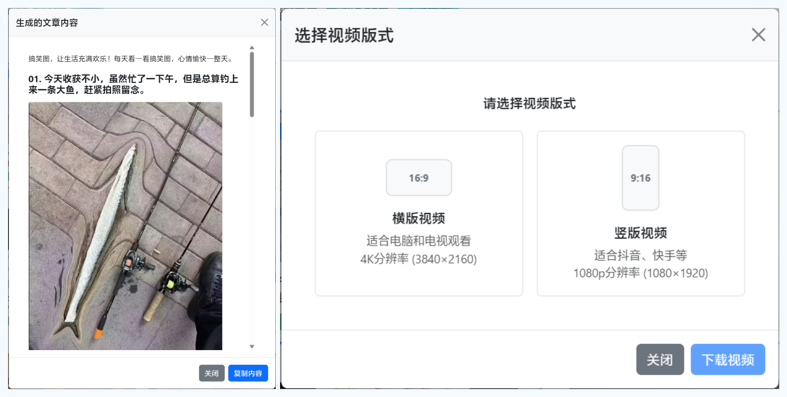

# 图片素材管家

这是一个 Chrome 扩展，允许您通过右键菜单收集图片素材并添加备注，在管理器中，可以选择图片并生成图文文章和视频。

## 功能特点

- 图片上的右键菜单
- 保存图片并添加自定义备注
- 选择图片生成图文
- 选择图片生成视频（支持备注配音）
- 图文完全在本地保存和管理

## 应用截图

> [!NOTE]  
> 这个扩展最初是为了方便发布沙雕图的今日头条而开发的, 不过似乎没有什么流量，如果想要预览生成视频和文章的效果，欢迎去我的今日头条[开心团子](https://www.toutiao.com/c/user/token/MS4wLjABAAAA0KWOA0eO3n6L55viV0N43QnxivKLqdSqIhU7MOPu1Lw/)看看，当然也欢迎关注呀。

## 安装方法

1. 下载或克隆本项目到本地  
2. 在项目目录下，复制 `app/js/settings.example.js` 为 `app/js/settings.js`，并根据注释填写您的 API Token 等配置信息  
3. 打开 Chrome 浏览器并访问 `chrome://extensions/`  
4. 在右上角启用“开发者模式”  
5. 点击“加载已解压的扩展程序”并选择本项目目录中的 app 文件夹 
6. 扩展程序现已安装完成并可以使用

## 使用方法

1. 在任意网页上找到一张图片
2. 右键点击该图片
3. 从右键菜单中选择"收集图片素材"
4. 弹出窗口会显示图片预览
5. 在文本框中添加您的备注
6. 点击"保存图片"将图片和备注保存到管理器

## 技术说明

在 AI 盛行的今天，普通人制作属于自己的软件，变得更加容易，但是打包和构建应用程序却依然有一定的门槛。我觉得目前纯 JavaScript 已经可以实现很多功能，为了方便更多非程序员可以轻松的修改应用，而不用苦恼如何安装 node.js 以及 node modules，这个扩展项目我使用了 Preact (一个类似 React 的前端框架) 的无构建方案，解压载入 Chrome 即可运行。

https://preactjs.com/guide/v10/getting-started/#no-build-tools-route

## 加入交流群

如果你也对 Chrome 扩展开发，油猴脚本，手机/电脑自动化，以及试用各种有趣有用的工具感兴趣，欢迎加入我的知识星球**老狗工坊**一起交流。
如果你对开发并不了解，星球也可以提供一定的技术支持。

如果你有有趣的需求，而我也觉得有意思，我也会考虑做成 Chrome 扩展或者油猴脚本，开源出来。

https://wx.zsxq.com/group/88882844441282

## 许可证

本项目使用 [MIT 许可证](./LICENSE)。
